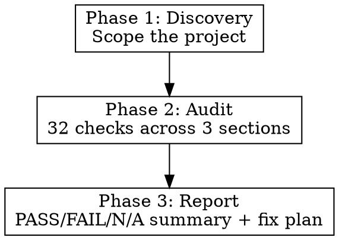

# Sui 2.0 Migration Audit

Systematically audit a TypeScript/JavaScript codebase for deprecated Sui SDK 1.x patterns across all three official migration guides, producing a structured report with fix plans for any failures.

## Workflow

Three phases: **Discovery** (scope the project), **Audit** (check every pattern), **Report** (structured output).



---

## Phase 1: Discovery

Identify what's in scope before checking anything.

1. **Find all source files**: Glob for `**/*.{ts,tsx,js,jsx}` excluding `node_modules`, `dist`, `build`
2. **Read `package.json`**: Record all `@mysten/*` dependency versions
3. **Catalog imports**: Grep all `@mysten/` import statements across the codebase
4. **Determine relevant areas**: Mark which sections apply:
   - Does the project use `dapp-kit`? (Section B)
   - Does the project use BCS? (A4-A8)
   - Does the project use zkLogin? (A11)
   - Does the project use GraphQL? (A12)
   - Does the project use `SerialTransactionExecutor`/`ParallelTransactionExecutor`?
   - Does the project make direct JSON-RPC calls? (Section C)

**Output**: List of relevant check sections and source file paths.

---

## Phase 2: Systematic Audit

Run every check using Grep/Read. Record PASS, FAIL (with file:line evidence), or N/A.

### Section A: `@mysten/sui` Package (14 checks)

| # | Check | Grep pattern | PASS when |
|---|-------|-------------|-----------|
| A1 | No `/client` subpath imports | `from ['"]@mysten/sui/client['"]` | Zero matches |
| A2 | `network` param on client constructors | All `new Sui*Client` calls | Every constructor uses `network:` |
| A3 | No `/experimental` subpath imports | `from ['"]@mysten/sui/experimental['"]` | Zero matches |
| A4 | BCS: `Failed` renamed to `Failure` | `\.status\.Failed` or `\.Failed\.error` | Zero matches |
| A5 | BCS: `ConsensusV2` renamed | `ConsensusV2` | Zero matches |
| A6 | BCS: `MoveObject` renamed to `Move` | `\.MoveObject` (on data enum) | Zero matches |
| A7 | BCS: `ObjectBcs` renamed | `ObjectBcs` | Zero matches |
| A8 | BCS: `unchangedSharedObjects` renamed | `unchangedSharedObjects` | Zero matches |
| A9 | `Commands` renamed to `TransactionCommands` | `import.*\bCommands\b.*from ['"]@mysten/sui/transactions` (not `TransactionCommands`) | Zero bare `Commands` imports |
| A10 | Named packages plugin removed | `namedPackagesPlugin`, `registerGlobalSerializationPlugin`, `registerGlobalBuildPlugin`, `unregisterGlobal` | Zero matches |
| A11 | zkLogin `legacyAddress` required | `computeZkLoginAddress`, `jwtToAddress`, `computeZkLoginAddressFromSeed`, `toZkLoginPublicIdentifier` — if used, verify `legacyAddress` param present | All calls include `legacyAddress` |
| A12 | GraphQL schema paths consolidated | `@mysten/sui/graphql/schemas/` (plural) | Zero matches (should be `/schema`) |
| A13 | `show*` options renamed | `showEffects`, `showEvents`, `showInput`, `showRawInput`, `showObjectChanges`, `showBalanceChanges` | Zero matches |
| A14 | Result format updated | `.data.effects`, `.effects?.status?.status` | Zero matches |

### Section B: dApp Kit (11 checks)

**N/A**: Entire section is N/A if project has no `@mysten/dapp-kit` or `@mysten/dapp-kit-react` dependency.

| # | Check | Grep pattern | PASS when |
|---|-------|-------------|-----------|
| B1 | Package renamed to `-react` | `package.json` deps + `from ['"]@mysten/dapp-kit['"]` (not `-react`, not `-core`) | Zero old package refs |
| B2 | Providers replaced by `DAppKitProvider` | `SuiClientProvider`, `WalletProvider` (from dapp-kit) | Zero matches |
| B3 | `createDAppKit()` factory used | `createDAppKit` | At least one match |
| B4 | Type registration via `declare module` | `declare module ['"]@mysten/dapp-kit-react['"]` | At least one match |
| B5 | Removed wallet action hooks gone | `useConnectWallet`, `useDisconnectWallet`, `useSignTransaction`, `useSignAndExecuteTransaction`, `useSignPersonalMessage`, `useSwitchAccount` | Zero matches |
| B6 | Removed data-fetching hooks gone | `useSuiClientQuery`, `useSuiClientMutation`, `useSuiClientInfiniteQuery`, `useSuiClientQueries`, `useResolveSuiNSNames` | Zero matches |
| B7 | Removed misc hooks gone | `useAutoConnectWallet`, `useAccounts`, `useWalletStore`, `useReportTransactionEffects` | Zero matches |
| B8 | `useSuiClient` renamed | `useSuiClient` (but not `useCurrentClient`) | Zero matches |
| B9 | Old CSS import removed | `@mysten/dapp-kit/dist` | Zero matches |
| B10 | `chain:` renamed to `network:` in calls | `chain:.*sui:` | Zero matches |
| B11 | `@tanstack/react-query` removed | `package.json` — `@tanstack/react-query` | Zero matches OR confirmed used independently |

### Section C: JSON-RPC to gRPC (7 checks)

| # | Check | Grep pattern | PASS when |
|---|-------|-------------|-----------|
| C1 | Old client classes gone | `new SuiJsonRpcClient`, `new SuiClient` (from `@mysten/sui/client`) | Zero matches |
| C2 | URL helpers removed | `getFullnodeUrl`, `getJsonRpcFullnodeUrl` | Zero matches |
| C3 | Constructor uses `baseUrl:` | All `new SuiGrpcClient` calls | Uses `baseUrl:` not `url:` |
| C4 | Deprecated method names gone | `\.getCoins(`, `\.getAllCoins(`, `\.getAllBalances(`, `\.getOwnedObjects(`, `\.multiGetObjects(`, `\.getDynamicFields(`, `\.getDynamicFieldObject(`, `\.devInspectTransactionBlock(`, `\.dryRunTransactionBlock(`, `\.getNormalizedMoveFunction(`, `\.getMoveFunctionArgTypes(` | Zero matches |
| C5 | `options: { show*` replaced by `include:` | `options:\s*\{[^}]*show` | Zero matches |
| C6 | Old response format gone | `.effects?.status?.status`, `result.data.effects` | Zero matches |
| C7 | JSON-RPC URL patterns gone | URLs containing `/json-rpc`, `getJsonRpcFullnodeUrl` | Zero matches |

---

## Phase 3: Report

Generate the structured report below. When all checks pass, output a clean summary confirming full compliance.

### Report Template

```
# Sui 2.0 Migration Audit Report

## Summary

| Section | Checks | PASS | FAIL | N/A |
|---------|--------|------|------|-----|
| A: @mysten/sui package | 14 | X | Y | Z |
| B: dApp Kit | 11 | X | Y | Z |
| C: JSON-RPC to gRPC | 7 | X | Y | Z |
| **Total** | **32** | **X** | **Y** | **Z** |

## Failures

### [ID] Check name

**Status**: FAIL
**File(s)**: `path/to/file.ts:line`
**Found**: `<deprecated pattern found>`
**Required**: `<what it should be>`
**Fix**: <code example or step-by-step>

(repeat for each failure)

## Fix Plan

1. [Ordered steps to fix all failures, grouped by file when possible]
2. ...

## Full Checklist

(Complete table with all PASS/FAIL/N/A items and evidence)
```

---

## N/A Logic

A check is N/A when the feature area is not used in the project:

| Feature area | N/A condition |
|-------------|---------------|
| BCS (A4-A8) | No BCS imports or usage |
| zkLogin (A11) | No zkLogin imports |
| GraphQL (A12) | No GraphQL imports |
| dApp Kit (B1-B11) | No `@mysten/dapp-kit` or `@mysten/dapp-kit-react` dependency |
| gRPC constructor (C3) | No `SuiGrpcClient` usage |

## Common Mistakes

| Mistake | Why it happens |
|---------|---------------|
| Missing `legacyAddress` in zkLogin | Parameter is new and easy to miss; breaks address derivation |
| Keeping `@tanstack/react-query` | Old dapp-kit required it; new one bundles its own state management |
| Using `showEffects` instead of `effects` | Muscle memory from v1 API; option naming changed silently |
| Importing from `@mysten/sui/client` | Subpath still resolves but is deprecated; use top-level import |
| Using `.data.effects` on results | Response shape changed; effects now directly on `result.Transaction` |
