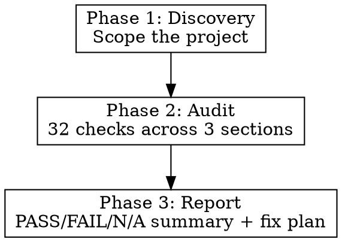

# Sui 2.0 Migration Audit

Systematically audit a TypeScript/JavaScript codebase for deprecated Sui SDK 1.x patterns across all three official migration guides, producing a single self-contained HTML audit file with fix plans for any failures.

## Workflow

Three phases: **Discovery** (scope the project), **Audit** (check every pattern), **Report** (structured output).


```dot
digraph audit_flow {
  rankdir=TB;
  discovery [label="Phase 1: Discovery\nScope the project" shape=box];
  audit [label="Phase 2: Audit\n32 checks across 3 sections" shape=box];
  report [label="Phase 3: Report\nPASS/FAIL/N/A summary + fix plan" shape=box];
  discovery -> audit -> report;
}
```

---

## Phase 1: Discovery

Identify what's in scope before checking anything.

1. **Find all source files**: Glob for `**/*.{ts,tsx,js,jsx}` excluding `node_modules`, `dist`, `build`
2. **Read `package.json`**: Record all `@mysten/*` dependency versions
3. **Catalog imports**: Grep all `@mysten/` import statements across the codebase
4. **Determine relevant areas**: Mark which sections apply:
   - Does the project use `dapp-kit`? (Section B)
   - Does the project use BCS? (A4-A8)
   - Does the project use zkLogin? (A11)
   - Does the project use GraphQL? (A12)
   - Does the project use `SerialTransactionExecutor`/`ParallelTransactionExecutor`?
   - Does the project make direct JSON-RPC calls? (Section C)

**Output**: List of relevant check sections and source file paths.

---

## Phase 2: Systematic Audit

Run every check using Grep/Read. Record PASS, FAIL (with file:line evidence), or N/A.

### Section A: `@mysten/sui` Package (14 checks)

| # | Check | Grep pattern | PASS when |
|---|-------|-------------|-----------|
| A1 | No `/client` subpath imports | `from ['"]@mysten/sui/client['"]` | Zero matches |
| A2 | `network` param on client constructors | All `new Sui*Client` calls | Every constructor uses `network:` |
| A3 | No `/experimental` subpath imports | `from ['"]@mysten/sui/experimental['"]` | Zero matches |
| A4 | BCS: `Failed` renamed to `Failure` | `\.status\.Failed` or `\.Failed\.error` | Zero matches |
| A5 | BCS: `ConsensusV2` renamed | `ConsensusV2` | Zero matches |
| A6 | BCS: `MoveObject` renamed to `Move` | `\.MoveObject` (on data enum) | Zero matches |
| A7 | BCS: `ObjectBcs` renamed | `ObjectBcs` | Zero matches |
| A8 | BCS: `unchangedSharedObjects` renamed | `unchangedSharedObjects` | Zero matches |
| A9 | `Commands` renamed to `TransactionCommands` | `import.*\bCommands\b.*from ['"]@mysten/sui/transactions` (not `TransactionCommands`) | Zero bare `Commands` imports |
| A10 | Named packages plugin removed | `namedPackagesPlugin`, `registerGlobalSerializationPlugin`, `registerGlobalBuildPlugin`, `unregisterGlobal` | Zero matches |
| A11 | zkLogin `legacyAddress` required | `computeZkLoginAddress`, `jwtToAddress`, `computeZkLoginAddressFromSeed`, `toZkLoginPublicIdentifier` — if used, verify `legacyAddress` param present | All calls include `legacyAddress` |
| A12 | GraphQL schema paths consolidated | `@mysten/sui/graphql/schemas/` (plural) | Zero matches (should be `/schema`) |
| A13 | `show*` options renamed | `showEffects`, `showEvents`, `showInput`, `showRawInput`, `showObjectChanges`, `showBalanceChanges` | Zero matches |
| A14 | Result format updated | `.data.effects`, `.effects?.status?.status` | Zero matches |

### Section B: dApp Kit (11 checks)

**N/A**: Entire section is N/A if project has no `@mysten/dapp-kit` or `@mysten/dapp-kit-react` dependency.

| # | Check | Grep pattern | PASS when |
|---|-------|-------------|-----------|
| B1 | Package renamed to `-react` | `package.json` deps + `from ['"]@mysten/dapp-kit['"]` (not `-react`, not `-core`) | Zero old package refs |
| B2 | Providers replaced by `DAppKitProvider` | `SuiClientProvider`, `WalletProvider` (from dapp-kit) | Zero matches |
| B3 | `createDAppKit()` factory used | `createDAppKit` | At least one match |
| B4 | Type registration via `declare module` | `declare module ['"]@mysten/dapp-kit-react['"]` | At least one match |
| B5 | Removed wallet action hooks gone | `useConnectWallet`, `useDisconnectWallet`, `useSignTransaction`, `useSignAndExecuteTransaction`, `useSignPersonalMessage`, `useSwitchAccount` | Zero matches |
| B6 | Removed data-fetching hooks gone | `useSuiClientQuery`, `useSuiClientMutation`, `useSuiClientInfiniteQuery`, `useSuiClientQueries`, `useResolveSuiNSNames` | Zero matches |
| B7 | Removed misc hooks gone | `useAutoConnectWallet`, `useAccounts`, `useWalletStore`, `useReportTransactionEffects` | Zero matches |
| B8 | `useSuiClient` renamed | `useSuiClient` (but not `useCurrentClient`) | Zero matches |
| B9 | Old CSS import removed | `@mysten/dapp-kit/dist` | Zero matches |
| B10 | `chain:` renamed to `network:` in calls | `chain:.*sui:` | Zero matches |
| B11 | `@tanstack/react-query` removed | `package.json` — `@tanstack/react-query` | Zero matches OR confirmed used independently |

### Section C: JSON-RPC to gRPC (7 checks)

| # | Check | Grep pattern | PASS when |
|---|-------|-------------|-----------|
| C1 | Old client classes gone | `new SuiJsonRpcClient`, `new SuiClient` (from `@mysten/sui/client`) | Zero matches |
| C2 | URL helpers removed | `getFullnodeUrl`, `getJsonRpcFullnodeUrl` | Zero matches |
| C3 | Constructor uses `baseUrl:` | All `new SuiGrpcClient` calls | Uses `baseUrl:` not `url:` |
| C4 | Deprecated method names gone | `\.getCoins(`, `\.getAllCoins(`, `\.getAllBalances(`, `\.getOwnedObjects(`, `\.multiGetObjects(`, `\.getDynamicFields(`, `\.getDynamicFieldObject(`, `\.devInspectTransactionBlock(`, `\.dryRunTransactionBlock(`, `\.getNormalizedMoveFunction(`, `\.getMoveFunctionArgTypes(` | Zero matches |
| C5 | `options: { show*` replaced by `include:` | `options:\s*\{[^}]*show` | Zero matches |
| C6 | Old response format gone | `.effects?.status?.status`, `result.data.effects` | Zero matches |
| C7 | JSON-RPC URL patterns gone | URLs containing `/json-rpc`, `getJsonRpcFullnodeUrl` | Zero matches |

---

## Phase 3: Report

Write a single self-contained HTML file (`sui-2-migration-audit.html` in the project root unless the user specifies otherwise). When all checks pass, output a clean summary confirming full compliance.

### Report Template

```html
<!DOCTYPE html>
<html lang="en">
<head>
  <meta charset="utf-8">
  <meta name="viewport" content="width=device-width, initial-scale=1">
  <title>Sui 2.0 Migration Audit Report</title>
  <style>/* inline CSS — see HTML Output Conventions below */</style>
</head>
<body>
  <header>
    <h1>Sui 2.0 Migration Audit Report</h1>
    <p class="subtitle">Project: <code>{repo-name}</code> · Audited: <time datetime="…">…</time></p>
  </header>

  <nav aria-label="Contents">
    <ul>
      <li><a href="#summary">Summary</a></li>
      <li><a href="#failures">Failures</a></li>
      <li><a href="#fix-plan">Fix Plan</a></li>
      <li><a href="#checklist">Full Checklist</a></li>
    </ul>
  </nav>

  <main>
    <section id="summary">
      <h2>Summary</h2>
      <table>
        <thead><tr><th>Section</th><th>Checks</th><th>PASS</th><th>FAIL</th><th>N/A</th></tr></thead>
        <tbody>
          <tr><td>A: <code>@mysten/sui</code> package</td><td>14</td><td>X</td><td class="fail">Y</td><td>Z</td></tr>
          <tr><td>B: dApp Kit</td><td>11</td><td>X</td><td class="fail">Y</td><td>Z</td></tr>
          <tr><td>C: JSON-RPC to gRPC</td><td>7</td><td>X</td><td class="fail">Y</td><td>Z</td></tr>
          <tr class="total"><th>Total</th><th>32</th><th>X</th><th class="fail">Y</th><th>Z</th></tr>
        </tbody>
      </table>
    </section>

    <section id="failures">
      <h2>Failures</h2>
      <!-- one <article> per failure -->
      <article class="finding fail" id="failure-A1">
        <header>
          <h3>A1 — <span class="check-name">Check name</span></h3>
          <span class="severity">FAIL</span>
        </header>
        <dl>
          <dt>File(s)</dt><dd><code>path/to/file.ts:line</code></dd>
          <dt>Found</dt><dd><pre><code>&lt;deprecated pattern found&gt;</code></pre></dd>
          <dt>Required</dt><dd><pre><code>&lt;what it should be&gt;</code></pre></dd>
        </dl>
        <details>
          <summary>Fix</summary>
          <pre><code>&lt;code example or step-by-step&gt;</code></pre>
        </details>
      </article>
      <!-- repeat per failure -->
    </section>

    <section id="fix-plan">
      <h2>Fix Plan</h2>
      <ol>
        <li>Ordered steps to fix all failures, grouped by file when possible</li>
        <li>…</li>
      </ol>
    </section>

    <section id="checklist">
      <h2>Full Checklist</h2>
      <table>
        <thead><tr><th>ID</th><th>Check</th><th>Status</th><th>Evidence</th></tr></thead>
        <tbody>
          <!-- one <tr> per check, status class "pass"/"fail"/"na" -->
        </tbody>
      </table>
    </section>
  </main>
</body>
</html>
```

When all 32 checks pass, the `#failures` and `#fix-plan` sections collapse into a single `<aside class="success">` ("All 32 checks passed — codebase is on SDK 2.0.") and `#checklist` becomes the only detail section.

---

## N/A Logic

A check is N/A when the feature area is not used in the project:

| Feature area | N/A condition |
|-------------|---------------|
| BCS (A4-A8) | No BCS imports or usage |
| zkLogin (A11) | No zkLogin imports |
| GraphQL (A12) | No GraphQL imports |
| dApp Kit (B1-B11) | No `@mysten/dapp-kit` or `@mysten/dapp-kit-react` dependency |
| gRPC constructor (C3) | No `SuiGrpcClient` usage |

## Common Mistakes

| Mistake | Why it happens |
|---------|---------------|
| Missing `legacyAddress` in zkLogin | Parameter is new and easy to miss; breaks address derivation |
| Keeping `@tanstack/react-query` | Old dapp-kit required it; new one bundles its own state management |
| Using `showEffects` instead of `effects` | Muscle memory from v1 API; option naming changed silently |
| Importing from `@mysten/sui/client` | Subpath still resolves but is deprecated; use top-level import |
| Using `.data.effects` on results | Response shape changed; effects now directly on `result.Transaction` |

---

## HTML Output Conventions

The audit report is a single self-contained `.html` file:

- **Doctype & shell**: `<!DOCTYPE html>`, `<html lang="en">`, `<head>` with `<meta charset="utf-8">`, viewport meta, `<title>`, single inline `<style>` block. No external CSS/JS, no CDNs.
- **Semantic tags**: `<header>`, `<nav>` (anchor links to summary, failures, fix plan, checklist), `<main>`, `<section id="…">`, `<article class="finding …">` per failure, `<aside class="success">` when everything passes.
- **Severity classes**: `pass`, `fail`, `na` on `<td>`/`<tr>`/`<article>` so the inline CSS can color-tag rows (muted greens/reds, not neon). Keep contrast accessible.
- **Per-failure structure**: `<article>` with a `<header>` (check ID + severity badge), a `<dl>` of metadata (File, Found, Required), and a `<details><summary>Fix</summary>…</details>` for the fix instructions — the summary table stays scannable while drill-down stays one click away.
- **Code**: `<pre><code>` for multi-line; `<code>` inline. Escape `<`/`>` in the displayed-code examples. No syntax-highlighter CDNs — color a few keywords via CSS classes if needed.
- **Tables**: `<thead>`/`<tbody>`; the totals row uses `<tr class="total">` with `<th>` cells.
- **CSS style**: small inline stylesheet — system-font stack, max-width ~80–90ch on the main column, comfortable line-height, mobile-responsive via one `@media (max-width: 720px)` block. Avoid gradients, glass-morphism, emoji-decorated headers.
- **No JavaScript**.

When unsure how rich to go, lean on the examples at https://thariqs.github.io/html-effectiveness/.
